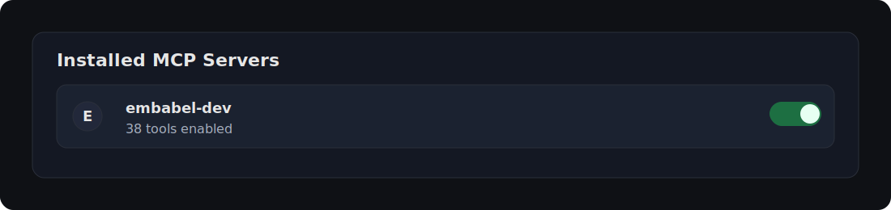

# Embabel Hub Backend: Chat and MCP Server


Embabel Hub exposes resources relating to the Embabel Agent Framework, such
as documentation, relevant blogs and other content, and up-to-the-minute API information.

This is exposed in two ways:

- Via a chatbot for the Embabel Hub front end
- Via an MCP server for integration with Claude Desktop, Claude Code and
  other MCP clients

## Loading data

```bash
curl -X POST http://localhost:1337/api/v1/data/load-references
```

## Viewing and Deleting Data

Go to the Neo Browser at http://localhost:7474/browser/

Log in with username `neo4j` and password `brahmsian` (or your custom password if you set one).

To delete all data run the following query:

```cypher

MATCH (n:ContentElement)
DETACH DELETE n
```

## Exposing MCP Tools

Starting the server will expose MCP tools on `http://localhost:1337/sse`.

### Verifying With MCP Inspector (Optional)

An easy way to verify the tools are exposed and experiment with calling them is by running the MCP inspector:

```bash
npx @modelcontextprotocol/inspector
```

Within the inspector UI, connect to `http://localhost:1337/sse`.

### Consuming MCP Tools With Claude Desktop

Add this stanza to `claude_desktop_config.json`:

```yml
{
  "mcpServers": {

    "embabel-dev": {
      "command": "npx",
      "args": [
        "-y",
        "mcp-remote",
        "http://localhost:1337/sse",
        "--transport",
        "sse-only"
      ]
    },
                  ...
  }
```

See [Connect Local Servers](https://modelcontextprotocol.io/docs/develop/connect-local-servers) for detailed
documentation.

### Consuming MCP Tools With Claude Code

If you're using Claude Code, adding the Embabel MCP server will
powerfully augment its capabilities for working on Embabel applications
and helping you learn Embabel.

```bash
claude mcp add embabel --transport sse http://localhost:1337/sse
```

Within the Claude Code shell, type `/mcp` to test the connection. Choose the number of the `embabel` server to check its
status.

Start via `claude --debug` to see more logging.

See [Claude Code MCP documentation](https://code.claude.com/docs/en/mcp) for further information.

### Consuming MCP Tools With Cursor

#### 1) Ensure the MCP server is running

Before troubleshooting Cursor, confirm the server is up and returning SSE headers:

```bash
curl -i --max-time 3 http://localhost:1337/sse
```

If you're running the server on a different port (for example `1338`), update the URL accordingly.

#### 2) Configure Cursor MCP

Cursor MCP config (Linux):

- `~/.cursor/mcp.json`

Example (recommended: use `mcp-remote` as a stdio bridge for SSE):

```json
{
  "mcpServers": {
    "embabel-dev": {
      "command": "npx",
      "args": ["-y", "mcp-remote", "http://localhost:1337/sse", "--transport", "sse-only"]
    }
  }
}
```

#### 3) Reload Cursor to reconnect

If you start the server after Cursor is already running, or if the server was temporarily down, Cursor may not
automatically respawn the MCP process. In Cursor:

- **Command Palette** → **Developer: Reload Window**

You should then see the MCP server listed with tools enabled:



#### Auto-Approving Embabel MCP Tools

By default, Claude Code asks for confirmation before running MCP tools. When you accept a tool with "Yes, don't ask
again", Claude Code saves that permission to your local `.claude/settings.local.json` file (which is auto-ignored by
git).

**Note:** Wildcards do not work for MCP tool permissions. Each tool must be approved individually or listed explicitly
in your settings.

**Tool naming:** By default, `guide.toolPrefix` is empty, so MCP tools are exposed with their original names (e.g.,
`mcp__embabel__docs_vectorSearch`). You can set a custom prefix in your application configuration to namespace your
tools.

See [Claude Code Permission Modes](https://code.claude.com/docs/en/iam#permission-modes) for detailed documentation on
how permissions work.

## Writing a Client

The backend supports any client via WebSocket (for real-time chat) and REST (for authentication).

### WebSocket Chat API

**Endpoint:** `ws://localhost:1337/ws`

Uses STOMP protocol over WebSocket with SockJS fallback. Any STOMP client library works (e.g., `@stomp/stompjs` for JavaScript, `stomp.py` for Python).

**Authentication:** Pass an optional JWT token as a query parameter:

```
ws://localhost:1337/ws?token=<JWT>
```

If no token is provided, an anonymous user is created automatically.

#### STOMP Channels

| Direction | Destination             | Purpose                       |
| --------- | ----------------------- | ----------------------------- |
| Subscribe | `/user/queue/messages`  | Receive chat responses        |
| Subscribe | `/user/queue/status`    | Receive typing/status updates |
| Publish   | `/app/chat.sendToJesse` | Send message to AI bot        |
| Publish   | `/app/presence.ping`    | Keep-alive (send every 30s)   |

#### Message Formats

**Sending a message:**

```json
{ "body": "your message here" }
```

**Receiving a message:**

```json
{
  "id": "550e8400-e29b-41d4-a716-446655440000",
  "content": "response text",
  "userId": "bot:jesse",
  "userName": "Jesse",
  "timestamp": "2025-12-16T10:30:00Z"
}
```

**Receiving a status update:**

```json
{
  "fromUserId": "bot:jesse",
  "status": "typing"
}
```

### REST API

CORS is open (`*`), no special headers required beyond `Content-Type: application/json`.

#### Authentication Endpoints

**Register:**

```
POST /api/hub/register
{
  "userDisplayName": "Jane Doe",
  "username": "jane",
  "userEmail": "jane@example.com",
  "password": "secret",
  "passwordConfirmation": "secret"
}
```

**Login:**

```
POST /api/hub/login
{ "username": "jane", "password": "secret" }

Response:
{ "token": "eyJhbG...", "userId": "...", "username": "jane", ... }
```

**List Personas:**

```
GET /api/hub/personas
```

**Update Persona** (requires auth):

```
PUT /api/hub/persona/mine
Authorization: Bearer <JWT>
{ "persona": "persona_name" }
```

### Example: Minimal JavaScript Client

```javascript
import { Client } from '@stomp/stompjs';
import SockJS from 'sockjs-client';

const client = new Client({
  webSocketFactory: () => new SockJS('http://localhost:1337/ws'),
  onConnect: () => {
    // Subscribe to responses
    client.subscribe('/user/queue/messages', (frame) => {
      const message = JSON.parse(frame.body);
      console.log('Received:', message.content);
    });

    // Send a message
    client.publish({
      destination: '/app/chat.sendToJesse',
      body: JSON.stringify({ body: 'Hello!' }),
    });
  },
});

client.activate();
```

## Docker

### Start (Docker Compose)

This will start `neo4j` + `guide`.

```bash
docker compose up --build -d
```

#### Port conflicts

If port `1337` is already in use (for example, the `chatbot` app is running), override the exposed port:

```bash
GUIDE_PORT=1338 docker compose up --build -d
```

This maps container port `1337` → host port `1338`, so MCP SSE becomes:

- `http://localhost:1338/sse`

#### Compose config overrides

Docker Compose supports environment variable overrides. You can set them inline (shown below) or put them in a local
`.env` file next to `compose.yaml` (Docker Compose auto-loads it).

- **`GUIDE_PORT`**: override host port mapping (default `1337`)
- **`OPENAI_API_KEY`**: required for LLM calls
- **`NEO4J_VERSION` / `NEO4J_USERNAME` / `NEO4J_PASSWORD`**: Neo4j settings (optional)
- **`DISCORD_TOKEN`**: optional, to enable the Discord bot

#### OpenAI API key

The `guide` container needs `OPENAI_API_KEY`. You can:

1. **Create a `.env` file** next to `compose.yaml`:

```bash
OPENAI_API_KEY=sk-your-key-here
```

2. **Or pass it inline**:

```bash
OPENAI_API_KEY=sk-... docker compose up --build -d
```

#### Verify MCP

```bash
PORT=${GUIDE_PORT:-1337}
curl -i --max-time 3 "http://localhost:${PORT}/sse"
```

You should see `Content-Type: text/event-stream` and an `event:endpoint` line.

#### Optional: run the frontend

The `frontend` service is behind a Compose profile (it requires the `../embabel-hub` repo checkout):

```bash
COMPOSE_PROFILES=frontend docker compose up --build -d
```

#### Stop

```bash
docker compose down --remove-orphans
```

### Environment Variables

| Variable         | Default                        | Description            |
| ---------------- | ------------------------------ | ---------------------- |
| `NEO4J_VERSION`  | `2025.10.1-community-bullseye` | Neo4j Docker image tag |
| `NEO4J_USERNAME` | `neo4j`                        | Neo4j username         |
| `NEO4J_PASSWORD` | `brahmsian`                    | Neo4j password         |
| `OPENAI_API_KEY` | (required)                     | OpenAI API key         |
| `DISCORD_TOKEN`  | (optional)                     | Discord bot token      |

Example:

```bash
NEO4J_PASSWORD=mysecretpassword OPENAI_API_KEY=sk-... GUIDE_PORT=1338 docker compose up --build -d
```

## Testing

### Prerequisites

Tests require the following:

1. **OpenAI API Key**: Set `OPENAI_API_KEY` in your environment before running tests:

```bash
export OPENAI_API_KEY=sk-your-key-here
```

2. **Neo4j**: See the [Local vs CI Testing](#local-vs-ci-testing) section below.

### Local vs CI Testing

The test suite uses Neo4j, which can be provided in two ways:

| Mode                  | `USE_LOCAL_NEO4J` | How Neo4j is provided                       | Best for                                       |
| --------------------- | ----------------- | ------------------------------------------- | ---------------------------------------------- |
| **CI (default)**      | `false`           | Testcontainers spins up Neo4j automatically | GitHub Actions, fresh environments             |
| **Local development** | `true`            | You run Neo4j via Docker Compose            | Faster iteration, avoids Testcontainers issues |

#### For Local Development

Some Docker environments have version mismatches that cause Testcontainers to fail. To run tests locally:

1. **Start Neo4j**:

```bash
docker compose up neo4j -d
```

2. **Run tests with `USE_LOCAL_NEO4J=true`**:

```bash
export OPENAI_API_KEY=sk-your-key-here
USE_LOCAL_NEO4J=true ./mvnw test
```

Or add to your shell profile for persistence:

```bash
export USE_LOCAL_NEO4J=true
```

#### For CI

Leave `USE_LOCAL_NEO4J = false` (the default). GitHub Actions has a compatible Docker environment where Testcontainers works correctly.

### Running Tests

```bash
./mvnw test
```

All 38 tests should pass, including:

- Hub API controller tests
- User service tests
- Neo4j repository tests
- **MCP Security regression tests** (verifies `/sse` and `/mcp` endpoints are not blocked by Spring Security)

## Miscellaneous

Sometimes (for example if your IDE crashes) you will be left with an orphaned server process and won't be able to
restart.
To kill the server:

```aiignore
lsof -ti:1337 | xargs kill -9
```
